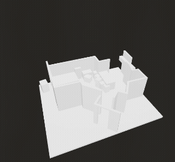

<p align="center">
  
</p>

<p align="center">
  <strong>Hylios</strong> · <em>Magical Space Intelligence</em><br/>
  Scan a room with LiDAR → get a precise, shareable 3D model. ✨
</p>

<p align="center">
  <a href="https://apps.apple.com/us/app/hylios/id6474466548"></a>
  
  
  
  
</p>

---

Hylios turns the space around you into a **parametric 3D model**. Walk a room with an
iPhone or iPad Pro and RoomPlan builds a measurable, exportable scan in real time — for
architecture, renovation, design, engineering, or the sheer magic of capturing a place.

> 🚧 **Revival in progress.** Hylios is being modernized to **SwiftUI + Swift 6, iOS 18+**
> with modern RoomPlan, haptics, Live Activities, an updated **App Clip**, and opt-in
> **Liquid Glass** on iOS 26. The full plan lives at [`docs/REVIVAL-PLAN.md`](docs/REVIVAL-PLAN.md).

<p align="center">
  
</p>
<p align="center"><sub>Scan → model. Full clips: <a href="docs/demo/hylios-scan.mp4">scan</a> · <a href="docs/demo/hylios-demo.mp4">demo</a></sub></p>

## ✨ Features

- **🪄 LiDAR room scanning** — RoomPlan constructs a parametric 3D model of your space live, with walls, doors, windows, and openings detected automatically.
- **🧊 USDZ export** — export `.parametric`, `.mesh`, or `.all`; share to Files, Messages, Mail, or straight into a 3D pipeline.
- **🏷️ Space classification** — residential / commercial / public, each with subtypes, so scans are organized by context.
- **📐 App Clip** — invoke a guided scan from a link or QR code and try Hylios instantly, no install required.
- **🌸 Revival additions** — haptics, an animated SwiftUI surface, Live Activities for long scans, and Liquid Glass on iOS 26.

## 📱 Requirements

- An **iPhone Pro or iPad Pro with a LiDAR scanner** (RoomPlan requires LiDAR).
- **iOS 18+** after the revival (the shipping build targets iOS 16+).
- Xcode 16+ to build.

## 🛠️ Tech stack

| Layer | Tech |
|-------|------|
| UI | SwiftUI (revival) — previously UIKit + Storyboards |
| Language | Swift 6, strict concurrency (revival) |
| Scanning | `RoomPlan` (`RoomCaptureView`, `RoomCaptureSession`, `CapturedRoom`) |
| 3D | `RealityKit` / SceneKit for USDZ preview |
| Engagement | `ActivityKit` Live Activities · `UIKit` haptics |
| Delight | iOS 26 `Liquid Glass` (opt-in via availability) |

## 🚀 Build & run

```bash
git clone https://github.com/Ripnrip/Hylios.git
cd Hylios
open EtherealDimension.xcodeproj
```

Pick an **iPhone Pro** simulator (or a real LiDAR device for a true scan) and run the
`EtherealDimension` scheme. RoomPlan's full capture flow needs physical LiDAR hardware;
the simulator is useful for UI work only.

## 🗺️ Roadmap

See [`docs/REVIVAL-PLAN.md`](docs/REVIVAL-PLAN.md) for the phased plan:
1. ✅ Consolidate onto `Ripnrip/Hylios` (history preserved from `noeticactivity/Hylios`)
2. ✅ Identity — animated banner, README, demo footage
3. 🚧 Foundation — Swift 6, iOS 18, fix camera-usage string, SwiftUI app shell
4. ⏳ Features — modern RoomPlan, haptics, animations, **Live Activities + App Clip**
5. ⏳ Ship — TestFlight via the Binary Bros ASC account

## 🙏 Acknowledgements

- **[open-swiftui-animations](https://github.com/amosgyamfi/open-swiftui-animations)** by [@amosgyamfi](https://github.com/amosgyamfi) — curated motion patterns ported into Hylios (revival).
- **Apple RoomPlan** sample *“Scanning the rooms of a real building”* — the original scaffold for the capture flow.
- Animated banner technique inspired by [browser-use/browser-harness](https://github.com/browser-use/browser-harness).

## 📄 License

MIT © 2024–2026 Gurinder Singh / Binary Bros LLC. See [LICENSE](LICENSE).
